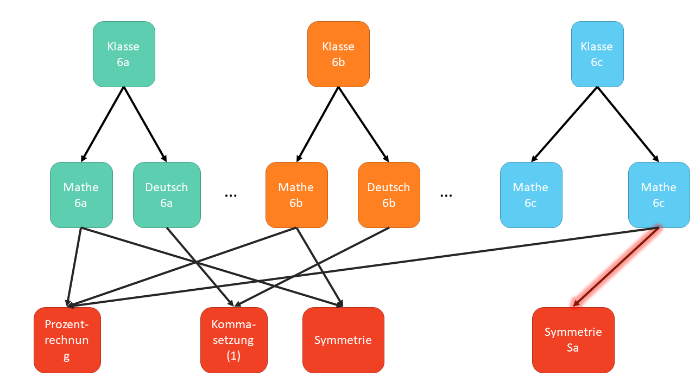

# Moodle 3D

Moodle 3D ist ein Konzept wie Moodle-Kurse im Schulkontext gut umgesetzt werden können. 

Das Konzept wurde ursprünglich von https://twitter.com/w_wobble untem dem Namen "Merüf-Prinzip" entwickelt.

## Zentrale Ideen:

  * Stärkung des kollaborativen Austauschs
  * Einheitliche Struktur hilft Schülern bei der Orientierung in Moodle
  * Effizienter Austausch von Moodle-Materialien

## Aufbau

Das 3D-Modell ist auf 3 Ebenen aufgebaut:

### Ebene 1: Klassenkurse

Auf Ebene 1 finden sich Klassenkurse. Hier finden sich alle Materialien für die **Klasse**, z.B. der Link zu einer Videokonferenz oder z.B. Materialien die in der Klasse eingesammelt werden.

Außerdem findet sich hier ein Link zu allen Fächern:

#### Beispiel

### Ebene 2: Fachkurse

Auf Ebene 2 finden sich die Fachkurse. Hier findet sich alles, was für die **Klasse** **und** das **Fach** von Bedeutung sind, z.B. aktuelle Abgaben und ein Link zum aktuellen Thema.

#### Beispiel

### Ebene 3: Inhaltskurse

Auf Ebene 3 finden sich Inhaltskurse. Die Inhaltskurse sind Kurse zu bestimmten Themen in einem Fach, z.B. Lineare Funktionen, Prozentrechnung, […]

#### Beispiel

## FAQ

* **Warum brauche ich einzelne Inhaltskurse?**
  Dadurch, dass die Themen in einzelne Inhalte aufgespalten sind, können Lehrer gemeinsam Inhaltskurse bearbeiten. In ihren Fachkursen müssen sie dann jeweils nur einen Link zu dem entsprechenden Fachkurs setzen. Auf diese Art wird Teamarbeit gefördert.
* **Wofür brauche ich dann noch Fachkurse?**
  In Inhaltskursen können Schüler unterschiedlicher Klassen teilnehmen. Wenn es etwas gibt, dass in Klassen unterschiedlich gehandhabt wird (z.B. andere Abgabetermine für Hausaufgaben, Sprechstunden etc.), dann findet sich dies im Fachkurs.
* **Verliere ich da nicht die Freiheit individuell Sachen anders zu machen?**
  Nein. Du kannst Inhaltskurse verlinken. Du kannst diese aber auch klonen und an deine eigene Bedürfnisse anpassen.

## Best Practices

* Das Merüf-Prinzip: Das Merüf-Prinzip besteht aus [M]otivation, [E]rarbeitung, [R]egeln, [Ü]bungen, [T]ransfer. Dies ist im usprünglichen Konzept der Grundaufbau von allen **Inhaltskursen** und bietet auf diese Weise Schülern eine einheitliche Struktur.

## Hilfreiche Module

Welche Module sind hilfreich, um das Konzept umzusetzen?

* **Subcourse**: Damit können Bewertungen aus Unterkursen in die Elternkurse übernommen werden. https://moodle.org/plugins/mod_subcourse
* **Course Templates**: Damit können Templates zur Erstellung von Inhaltskursen vorgegeben werden. https://moodle.org/plugins/local_course_templates
* **Filtered Course Lists**: Damit können Backlinks von den Inhaltskursen zu den oberen Ebenen realisiert werden. Hier können **Meine Fachkurse** oder **Meine Klassenkurse** angezeigt werden. Mit Javascript kann darüber auch der Breadcrumb überschrieben werden.